#Proyecto API en GO

En este proyecto se implementa una API sobre las actividades complementarias en el Tecnológico Nacional de México en Go y Docker

##Uso de Jenkins
Se siguió la idea de usar un BuildAppJob, TestAppJob y PipelineJob con el material de Cisco que se proporcionó en clase

###Ejecutar Docker de Jenkins
En un inicio habíamos iniciado un Docker dentro de Windows, sin embargo, con el punto siguiente que se nos presentó, perdimos el comando para ejecutar Jenkins en Windows (debido a que no se empleó directamente desde Docker Desktop porque se presentaban problemas). Sin embargo, en Linux empleamos el siguiente comando:
`docker run --rm -u root -p 8080:8080 -v jenkins-data:/var/jenkins_home -v $(which docker):/usr/bin/docker -v /var/run/docker.sock:/var/run/docker.sock -v "$HOME":/home --name jenkins_server jenkins/jenkins:lts`

###Problemas Jenkins Windows
Se tuvo en un inicio problemas con emplear Jenkins directamente en Windows, presentando problemas a la hora de querer hacer un test de buildApp 
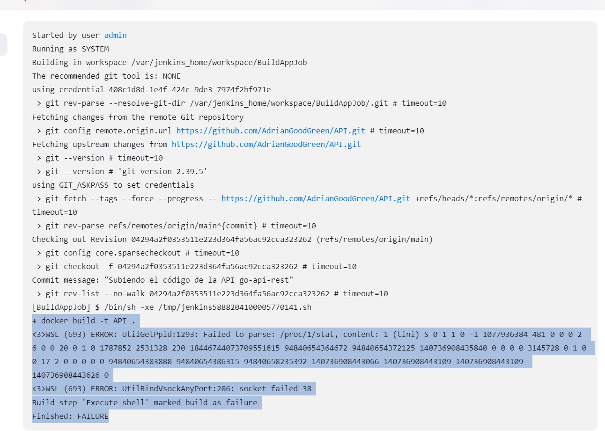

###BuildAppJob
Primero se crea un item con FreeStyle. Dentro de este se este se emplea el comando `docker build -t api-image .` para construir la imagen. En la imagen se muestra cada paso para la creación del contenedor
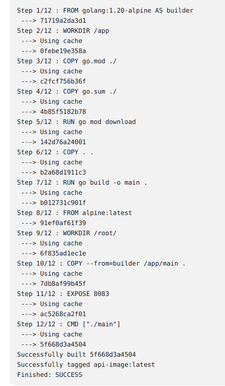

###TestAppJob
En el test empezamos a presentar problemas. Queriamos emplear el comando `docker run --rm api-image go test -v ./... > test_results.log`. Sin embargo a la hora de construir se nos presentaban múltiples problemas a la hora de ejecutar el test
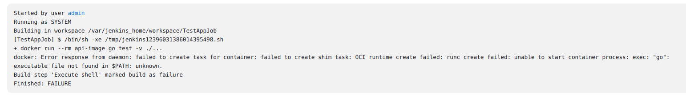

Posteriormente consideramos en emplear el comando `docker exec api-container go test -v ./... > test_results.log`. Pero seguiamos con el mismo problema
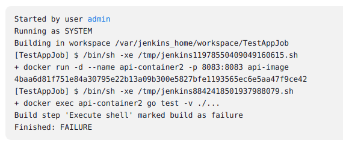

Finalmente optamos por modificar el Dockerfile para que realice un Build y de una vez realice un Test
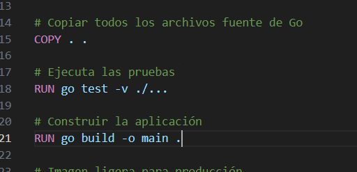

Donde de igual manera se emplea `docker build -t api-image .`

Salida en Jenkins
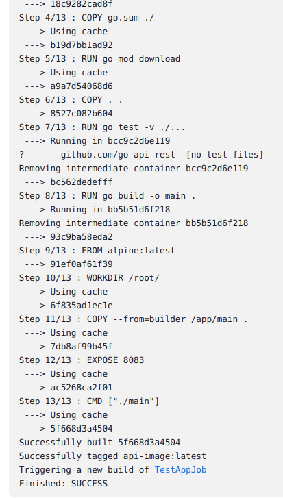

###Pipeline
Se realizaron 2 pipeline debido a que conforme se sigue la práctica de Cisco, es unir el Build y Test, cosa que al final nosotros hicimos de una dentro del Dockerfile y crear únicamente uno donde se hace lo mismo pero en un Pipeline era muy simple

####SamplePipeline
Dentro de este Pipeline es el Build y test pero integrado en este tipo de construcción. Se empleó el siguiente archivo:
[Sample Pipeline Jenkins](SamplePipeline)

Salida en Jenkins
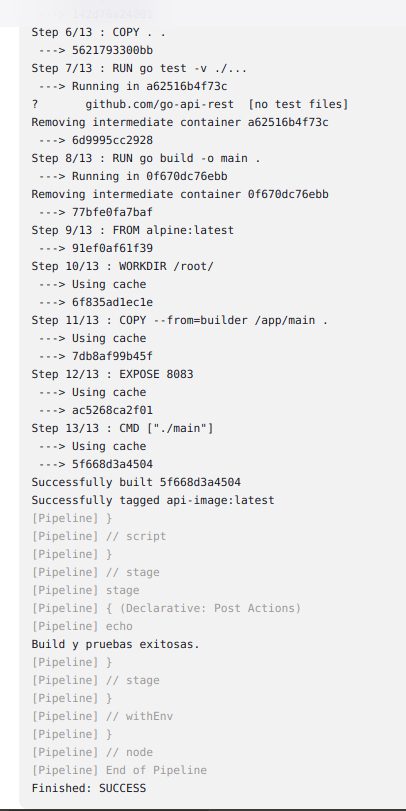

####PipelineTest
Para este Pipeline, se realiza un Test para accionar un curl y empleando un `GET` de las actividades que están en el archivo [main](main.go). Para ello, al igual que el anterior se llegó a utilizar directamente un archivo y que, en Jenkins lo ejecute:
[Pipeline Test Jenkins](PipelineTest)

Sin embargo, a la hora de ejecutarlo empezamos a presentar problemas y dentro de toda la búsqueda, detectamos que dentro del archivo `main.go` en `func main()` en [esta línea](https://github.com/AdrianGoodGreen/API/blob/main/main.go#L40) estaba como `localhost:8083` y se removió la parte de `localhost` para que de esta manera, funcionase correctamente

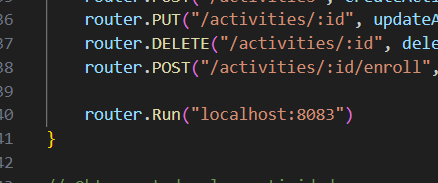
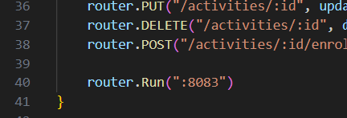

Salida en Jenkins
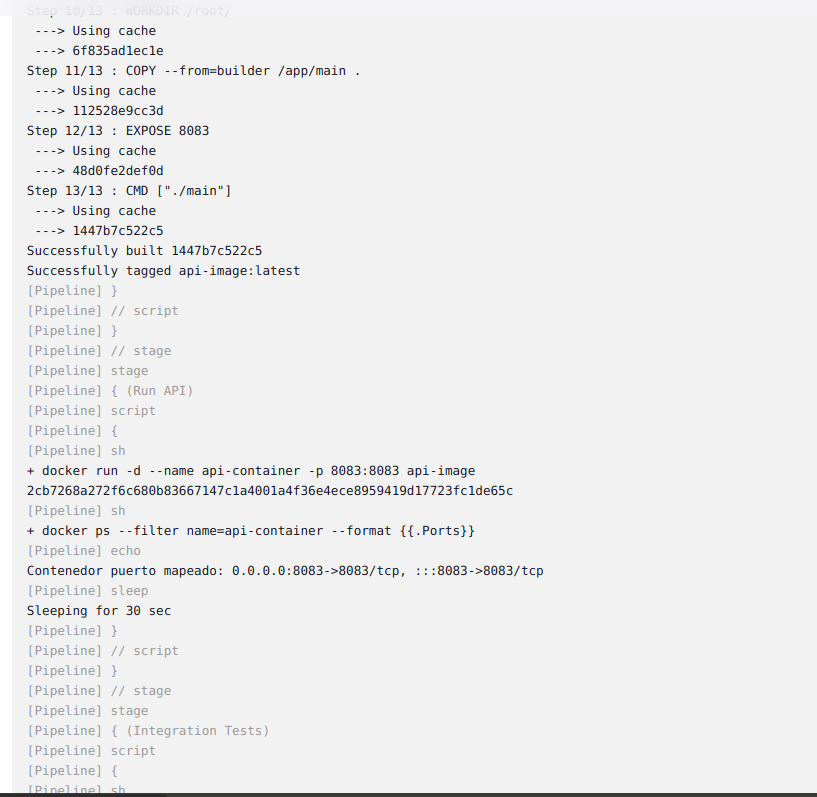
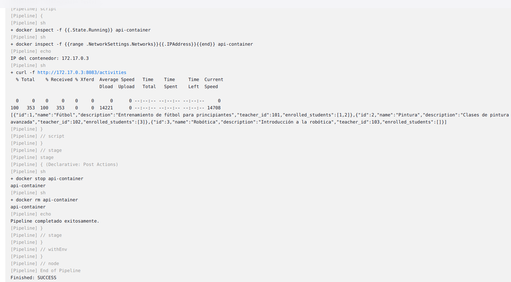

